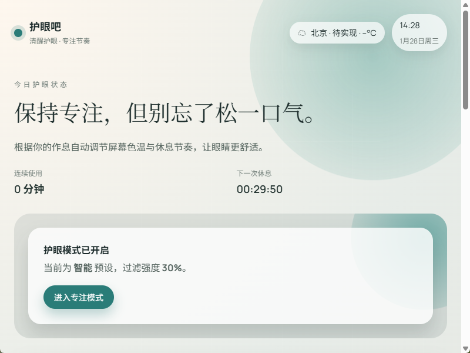
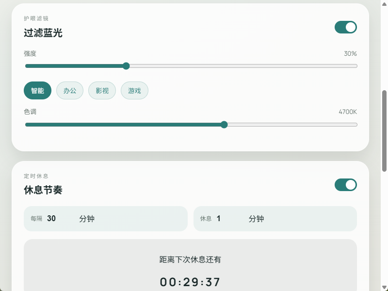
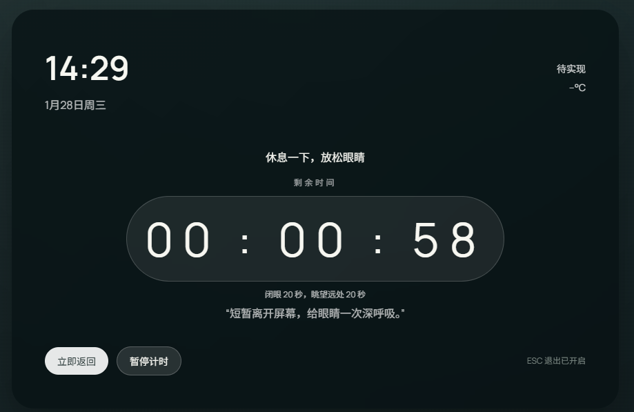
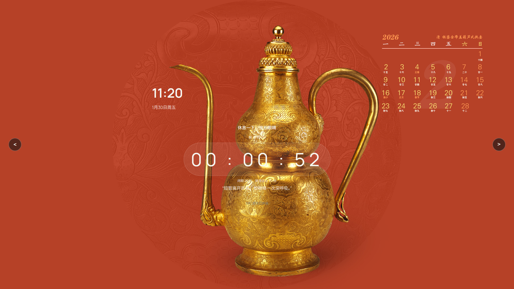

# 护眼吧 (huyanba)

桌面护眼小软件：防蓝光过滤 + 定时休息锁屏。

## 功能概览
- 过滤蓝光：强度 + 色调调节，预设模式（智能/办公/影视/游戏）
- 定时休息：默认每 30 分钟休息 1 分钟
- 全屏休息锁屏：多显示器覆盖、倒计时显示
- 托盘控制：显示/隐藏/立即休息/退出

## 界面截图
首页（护眼状态概览 + 下一次休息）


功能（过滤蓝光强度/色调 + 休息节奏）


锁屏（全屏覆盖 + 倒计时）


故宫壁纸功能（在线获取 + 缓存轮播）


## 安装包位置（本机）
```
D:\Ai\huyanba\huzamba\src-tauri\target\release\bundle\nsis\huyanba_0.1.0_x64-setup.exe
```

## 本地开发
```
cd D:\Ai\huyanba\huzamba
npm install
npm run tauri dev
```

## 打包（Windows 安装包）
```
cd D:\Ai\huyanba\huzamba
npm run tauri build
```

产物目录：
```
src-tauri\target\release\bundle
```

## 说明
- 过滤蓝光通过系统 gamma 曲线实现
- 锁屏使用全屏覆盖窗口（非系统锁屏）

---

# Huyanba (English)

Desktop eye-care app: blue-light filter + scheduled break lockscreen.

## Features
- Blue-light filter with strength + tone presets
- Scheduled breaks (default 30 minutes work / 1 minute rest)
- Fullscreen rest lockscreen (multi-monitor)
- Tray controls (show/hide/rest/quit)

## Screenshots
Home (status + next break)


Filter & Schedule


Lockscreen


Palace Museum wallpapers (online fetch + cached rotation)


## Installer (local path)
```
D:\Ai\huyanba\huzamba\src-tauri\target\release\bundle\nsis\huyanba_0.1.0_x64-setup.exe
```

## Development
```
cd D:\Ai\huyanba\huzamba
npm install
npm run tauri dev
```

## Build (Windows)
```
cd D:\Ai\huyanba\huzamba
npm run tauri build
```
